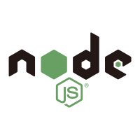
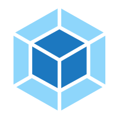

- ⌨️ Programming Languages I've used:

  
  
 
 
 
  
  
 
 

  

- 🙌 I'm currently looking for: **Web Development**
   

 

- 🔭 I’m currently working on: **Data structure and algorithms**
 

- 🌱 I’m currently learning: **Vue  || uniapp **
 

- 👯 I’m looking to collaborate on: **Developing new and intriguing open-source projects, with the community, for the community**

- 💬 Ask me about: **Technology || Technical Content Writing || Music || Reading**

- 🤓 Active User at: **GitHub || 掘金 || 哔哩哔哩**

- 📫 How to reach me:

  - [**Drop a Mail**](mailto:2135250352@qq.com)

  - [**Connect via 掘金**](https://juejin.cn/user/2937541623819671/posts)

  - [**Visit my Website**](https://tostar.fun/)

- 😄 Pronouns: **He/Him**

- ⚡ Fun Facts:

  - _Besides programming, I'm a [**Technical Content Writer**](https://tostar.fun/), love to cook._

  - _You know you're a programmer when you spend a day to find the problem, and then fix it with one line of code._

  - _If you're still reading, why not follow me ?? Let's Connect !!_
